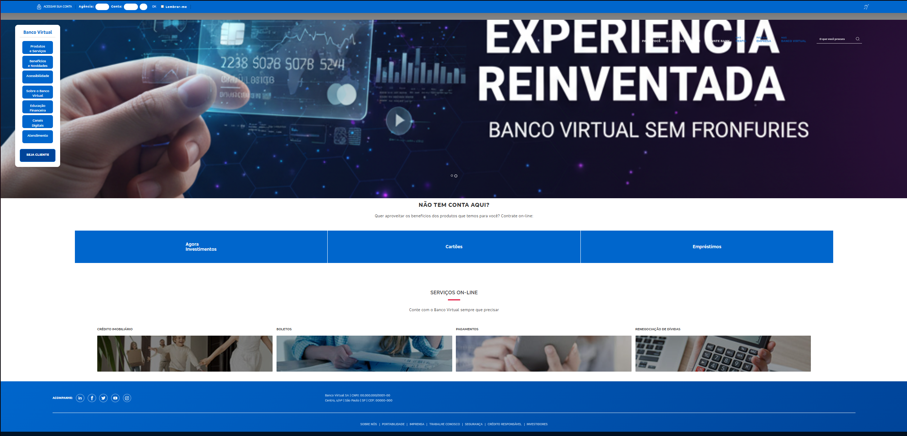
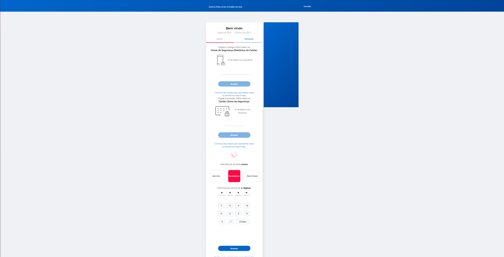
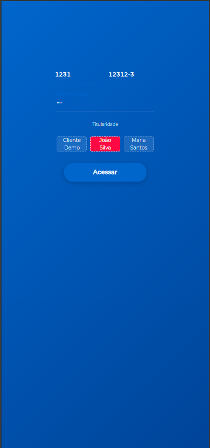

# 🏦 Banco Virtual - Portfolio Website

Um site de portfólio demonstrativo que simula a interface de um banco virtual moderno, desenvolvido com PHP, HTML, CSS e JavaScript.

## 🚀 **Demonstração Online**

**Acesse o site:** [Link do GitHub Pages ou Netlify]

## 📱 **Funcionalidades**

### **Versão Desktop**
- Interface responsiva e moderna
- Carousel de produtos e serviços
- Menu lateral interativo
- Paleta de cores azul profissional
- Navegação intuitiva

### **Versão Mobile**
- Design otimizado para dispositivos móveis
- Interface touch-friendly
- Menu hambúrguer
- Formulários adaptados para mobile
- Performance otimizada

### **Recursos Técnicos**
- Sistema de autenticação simulado
- Validação de formulários
- Teclado numérico virtual
- Carregamento dinâmico de conteúdo
- Compatibilidade cross-browser

## 🛠️ **Tecnologias Utilizadas**

- **Backend:** PHP 7.4+
- **Frontend:** HTML5, CSS3, JavaScript (ES6)
- **Frameworks:** Bootstrap, jQuery
- **Ícones:** Font Awesome, SVG
- **Responsividade:** CSS Grid, Flexbox
- **Compatibilidade:** Chrome, Firefox, Safari, Edge

## 📁 **Estrutura do Projeto**

```
banco-virtual-portfolio/
├── _admin/
│   └── config.php          # Configurações e funções do backend
├── css/                    # Estilos CSS
├── images/                 # Imagens e ícones
├── js/                     # Scripts JavaScript
├── mobile/                 # Versão mobile
│   ├── css/
│   ├── images/
│   ├── js/
│   └── *.php
├── index.php              # Página inicial
├── home.php               # Home desktop
├── identificacao.php      # Tela de login
├── validacao.php          # Validação de acesso
└── README.md
```

## 🚀 **Como Executar Localmente**

### **Pré-requisitos**
- XAMPP, WAMP ou servidor Apache
- PHP 7.4 ou superior
- Navegador web moderno

### **Instalação**
1. Clone o repositório:
   ```bash
   git clone https://github.com/SEU_USUARIO/banco-virtual-portfolio.git
   ```

2. Coloque os arquivos na pasta `htdocs` do XAMPP

3. Inicie o Apache no XAMPP

4. Acesse: `http://localhost/banco-virtual-portfolio`

## 📸 **Screenshots**

### **Desktop**

*Interface principal da versão desktop*


*Tela de identificação desktop*

### **Mobile**

*Interface mobile responsiva*


*Tela de login mobile*

## 🎨 **Design System**

### **Paleta de Cores**
- **Primária:** #0066cc (Azul principal)
- **Secundária:** #004499 (Azul escuro)
- **Acento:** #b3d9ff (Azul claro)
- **Texto:** #333333 (Cinza escuro)
- **Fundo:** #ffffff (Branco)

### **Tipografia**
- **Títulos:** Montserrat, sans-serif
- **Corpo:** Arial, sans-serif
- **Tamanhos:** 14px, 16px, 18px, 24px, 32px

## 🔧 **Funcionalidades Implementadas**

- ✅ **Responsividade** - Funciona em todos os dispositivos
- ✅ **Validação de Formulários** - Campos obrigatórios e formatos
- ✅ **Navegação Intuitiva** - Menu lateral e mobile
- ✅ **Carregamento Dinâmico** - Conteúdo carregado via AJAX
- ✅ **Sistema de Sessão** - Controle de acesso simulado
- ✅ **Teclado Virtual** - Para dispositivos touch
- ✅ **Otimização de Performance** - CSS e JS minificados

## 📱 **Compatibilidade**

| Navegador | Desktop | Mobile |
|-----------|---------|--------|
| Chrome    | ✅      | ✅     |
| Firefox   | ✅      | ✅     |
| Safari    | ✅      | ✅     |
| Edge      | ✅      | ✅     |

## 🚀 **Deploy**

### **GitHub Pages**
1. Ative o GitHub Pages nas configurações do repositório
2. Selecione a branch `main`
3. Acesse: `https://SEU_USUARIO.github.io/banco-virtual-portfolio`

### **Netlify**
1. Conecte o repositório ao Netlify
2. Configure o build command: `php -S localhost:8000`
3. Deploy automático a cada push

## 📄 **Licença**

Este projeto é apenas para fins de portfólio e demonstração.

## 👨‍💻 **Desenvolvedor**

**Seu Nome**
- GitHub: [@seu_usuario](https://github.com/SEU_USUARIO)
- LinkedIn: [Seu Perfil](https://linkedin.com/in/SEU_PERFIL)
- Email: seu.email@exemplo.com

---

**Desenvolvido com ❤️ para demonstrar habilidades em desenvolvimento web**